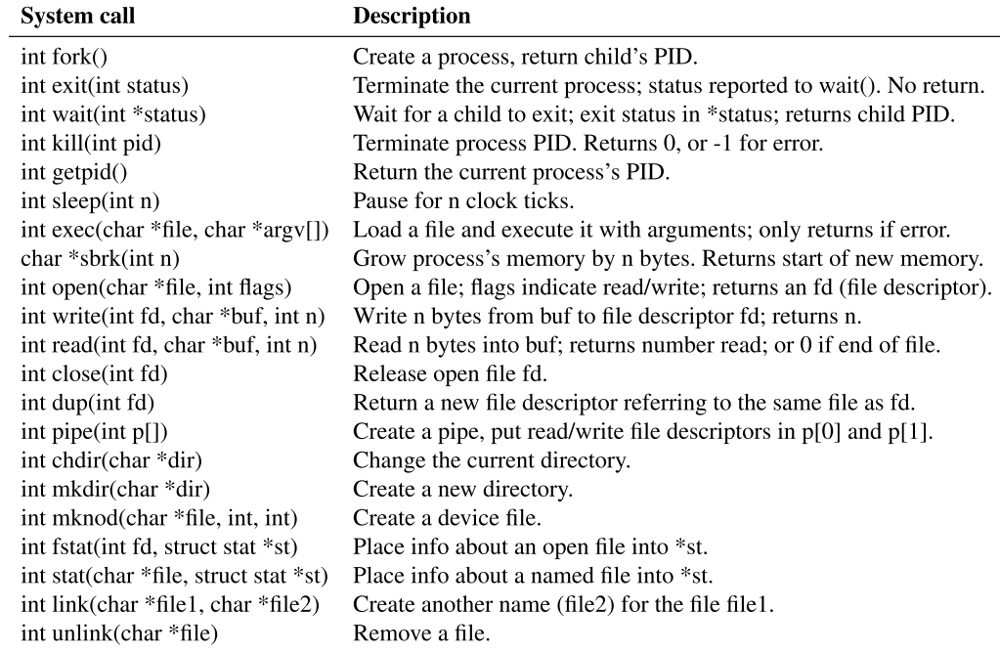

# Chapter 1 Operating system interfaces

操作系统的工作是在多个程序之间共享一个计算机，并提供一系列比硬件单独提供更有效的服务。一个操作系统管理和抽象了底层的硬件，因此，例如，一个文字处理器不需要关心使用那种类型的磁盘硬件。操作系统在多个程序中共享硬件，因此这些程序运行（近乎运行）在同一时间。最后，操作系统提供了可控的方式让程序与之进行交互，所以程序间可以共享数据或者一起工作。

操作系统以接口的形式提供服务给用户程序。设计一个好的接口是困难的。一方面，我们希望接口是简单明了的，因为这使得接口更容易得到正确的实现。另一方面，我们更想给应用程序提供很多复杂的特性。解决这些问题的方式是，设计接口时，接口依赖更少的机制，这些机制可以结合提供更好的通用性。（个人理解，接口设计要足够简单，且这些简单的接口结合起来可以解决大部分通用的问题）

本书使用单一的操作系统作为例子去阐明操作系统的概念。该操作系统，即xv6，提供了由Ken Thompson和Dennis Ritchie的Unix操作系统引入的基本接口，以及模仿了Unix的内部设计。Unix提供了简明的接口，且接口的机制结合的很好，从而提供了很好的通用性。这种接口非常成功，以至于现代操作系统--BSD、Linux、Mac OS X、Solaris，甚至在较小程度上，微软的Windows--都有类似Unix的界面。了解xv6是了解这些系统和其他许多系统的一个良好开端。

如图1.1所示，xv6采用了传统的内核形式，一个给运行中程序提供服务的特殊程序。每个运行的程序，称之为进程，包含指令、数据和栈的内存。指令实现了程序的计算。数据是计算动作所使用到的变量。栈组织程序的执行调用。一个典型的计算机有很多进程，但是只有一个内核。

当一个进程需要去调用内核服务时，他会调用系统调用，系统调用是操作系统接口调用的其中之一。系统调用进入到内核；内核执行服务然后返回。因此一个进程在用户空间和内核空间交替执行。（用户空间也称用户态，内核空间-内核态）

内核使用由CPU提供的硬件保护机制去确保-每一个执行在用户空间的进程只能访问他自己所拥有的内存。内核的执行拥有实现这些保护的硬件特权，而用户程序执行则没有这些特权。当一个用户程序调用一个系统调用，硬件会提升特权级别并开始执行一个预先安装在内核的方法。

一个内核所提供的系统系统调用的集合是用户程序看见的接口。xv6内核提供了传统Unix内核提供的服务和系统调用的子集。

图1.2列出了所有xv6的系统调用

图1.2：xv6系统调用（除非另外声明，这些系统调用返回0表示无误，返回-1表示出错）

本章节的剩余部分概述了xv6的服务-包括进程、内存、文件描述、管道和文件系统，并用代码片和如何使用shell使用这些服务来阐明。Shell是Unix的命令行用户界面。shell对系统调用的使用说明了它们的设计是多么的仔细。

Shell是一个普通程序，它从用户那里读取命令并执行它们。shell是一个用户程序，并不是内核的一部分，这个事实说明了系统调用接口的强大：shell并没有什么特别的地方。这也意味着shell是非常容易被替代的；因此，现代Unix系统有多种shell可供选择，每种shell都有自己的用户界面和脚本特性。xv6 shell是对Unix Bourne shell精华部分的简单实现。它的实现可以在（[xv6-riscv/sh.c at riscv · mit-pdos/xv6-riscv (github.com)](https://github.com/mit-pdos/xv6-riscv/blob/riscv//user/sh.c#L1)）找到。

[1.1 Processes and memory](/1-1Processes%20and%20memory.md)

[1.2 I/O and File descriptors](https://www.notion.so/1-2-I-O-and-File-descriptors-05a00ab45f9a4bfb8fe8a6aafae7ba00)

[1.3 Pipes（管道）](https://www.notion.so/1-3-Pipes-1dba7a0387ac451fb7eeae4b8b653441)