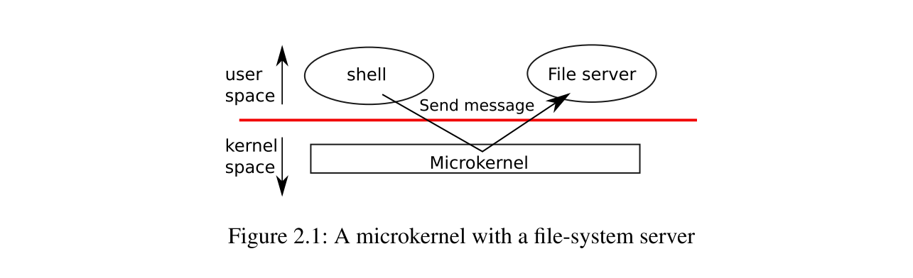

# 2.3 Kernel organization

---

一个关键点的设计问题是操作系统的哪部分应该运行在监督者（supervisor）模式。一个可能是，整个操作系统驻留在内核，因此所有系统调用的实现都运行在监督者模式。这种组织方式被称为宏内核模式。

在这种组织方式下，整个操作系统都以完全的硬件特权运行。虽然这也很便利，因为操作系统设计者不必要去决定操作系统哪一部分不需要全硬件特权。更进一步，这种组织模式使得操作系统不同部分合作更容易。例如，操作系统可以有一个缓存缓冲区，可以在文件系统和虚拟内存系统间共享。

宏内核的组织方式的一个缺点是，操作系统不同部分之间的接口是非常复杂的（正如我们会在本文的其余部分看到的那样），因此操作系统开发人员很容易犯错误。在宏内核中，犯一个错误就是致命的，因为在监督者模式下的一个错误经常会导致内核失败。如果内核失败，计算机将停止工作，从而所有应用都会失败。计算机必修重启。并在用户模式

为了减少内核出现错误的风险，操作系统设计者可以减少运行在监督者模式下操作系统代码的数量，并在用户模式下执行操作系统的大部分代码。这种内核组织方式被称为微内核。

图2.1展示了这种微内核设计。在图中，文件系统作为用户级进程运行。以进程形式运行的操作系统服务被称作服务器。为了让应用可以和文件服务交互，内核提供了一个进程间的交流机制，从一个用户级进程发送消息给他起用户级进程。例如， 如果一个应用，比如shell，想要读写一个文件，他会发送一个消息给文件服务，然后等待他的响应。

在微内核组织模式下，内核接口由一些低级别的函数组成，用于启动程序，发送消息，访问设备硬件，等等。这个组织方式运行内核变得相对简单，因为操作系统大部分驻留在用户级服务中。

Xv6是作为宏内核实现的，就像大多数Unix操作系统一样。因此，xv6内核接口和操作系统接口相对应，并且内核实现了完整的操作系统。因为xv6没有提供很多服务，他的内核比一些微内核还小，但是概念上它是宏内核的。