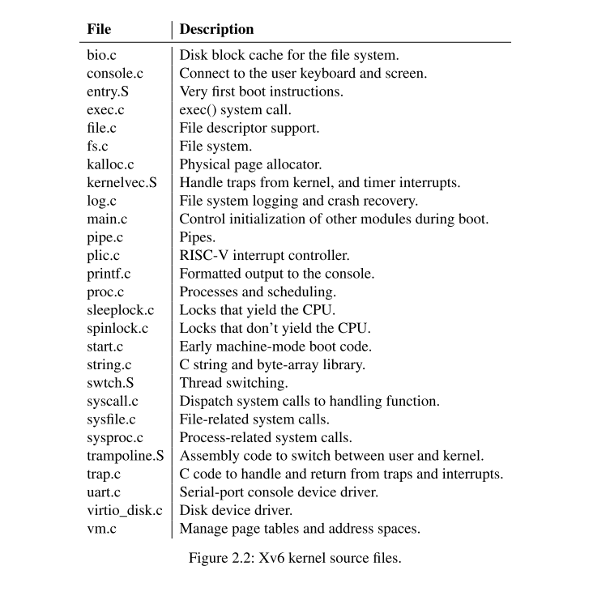

# 2.4 Code: xv6 organization

xv6内核源码在**kernel/**子目录下。按照模块化的概念，源码被分成了多个文件，图2.2列出了这些文件。模块间的接口在**defs.h(kernel/defs.h)**中定义。（[xv6-riscv/defs.h at riscv · mit-pdos/xv6-riscv (github.com)](https://github.com/mit-pdos/xv6-riscv/blob/riscv//kernel/defs.h)）

