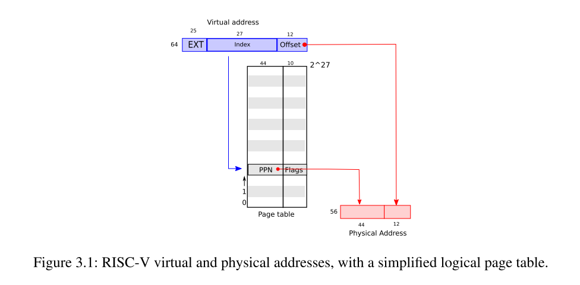
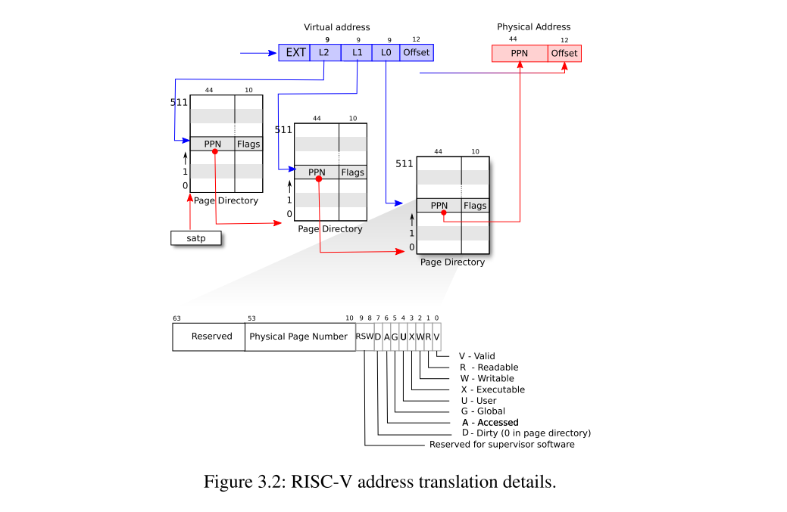

# 3.1 Paging hardware 分页硬件

提醒一哈，RISC-V指令无论user还是kernel都操作虚拟地址。机器的RAM或者物理内存是用物理地址来做索引的。RISC-V页表硬件将虚拟地址和物理地址联系起来，通过映射每一个虚拟地址到物理地址。

xv6运行在Sv39 RISC-V，意味着只有64位虚拟地址中低39位被使用；高25位没有被使用。在Sv39的配置，一个RISC-V页表在逻辑上是一个2^27（134,217,728）页表项(PTEs)的数组。每一个页表项包含44位物理页号(PPN-physical page number)和一些标志位。

分页硬件通过使用39位中的高27位索引页表找到一个页表项来转换一个虚拟地址，并计算出一个56位的物理地址，他的高44位来自页表项中的PPN，他的低12位来自于它原始的虚拟地址。图3.1显示了这个过程，从逻辑上看，页表是一个简单的PTE数组（见图3.2，更全面的介绍）。页表让操作系统控制虚拟到物理地址的转换，其粒度为4096（2^12）字节的对齐块。这样的块被称为一个页(图3.1虚拟地址的offset可以理解为数据在一个页内的地址)。

在Sv39 RISC-V, 虚拟地址的高25位不会在转换时使用；在未来，RISC-V或许使用这些位去定义更多等级的转换。物理地址也还有继续扩增的空间:在PTE格式下物理页号还有10位的增长空间。

正如图3.2，实际的地址转换有三步。一个页表在物理内存中被作为一个三层树存储。树的根部是一个4096字节(一个页表项64位，8位一个字节，所以一个页表项占8个字节，512个页表项也就是4096个字节)的页表页，其包含512个页表项，每一个页表项包含第二层页表页的物理地址。第二层的每一个页包含512页表项，其指向树的最后一层。在根页表页中分页硬件使用27位中的高9位选择一个页表项，使用中间9位在树的第二层页表页中选择一个页表项，使用低9位在最后一层页表页选择一个页表项。

如果三个需要去翻译一个地址的页表项中的任何一个不存在，分页硬件会引发一个页面错误异常(page-fault exception)，让内核来处理异常(看第四章)。这种三层结构可以允许页表忽略整个页表页，在大范围虚拟地址没有映射的情况下。

每一个页表项包含一些标志位，这些标志位告诉分页硬件如何使用相关的虚拟地址。PTE_V指PTE是否存在:如果这个标志没有设置，引用这个页会导致一个异常(即不允许).PTE_R控制页是否可以被指令读。PTE_W控制页是否可以被指令写。PTE_X控制CPU是否可以将页面内容解析为指令并执行它们。PTE_U控制是否用户模式下的指令被允许访问页；如果PTE_U没有被设置，这个页表项只能在监督者模式下使用。图3.2显示了这一切的工作原理。标志位和与页相关的结构体定义在(kernel/riscv.h)。

为了告诉硬件使用一个页表，内核必须把根页表页的物理地址写到satp寄存器中。每一个CPU都有他自己的satp寄存器。一个CPU使用它自己satp寄存器指向的页表转换所有接下来的指令产生的地址。每个CPU有它自己的satp寄存器，所以不同的CPU可以运行不同的进程，每一个进程都有被自己的页表描述的私有地址空间。

关于术语的一些说明。物理内存指的是DRAM的存储单元。物理内存中的每个字节有地址，成为物理地址。指令仅使用虚拟地址，分页硬件将它们转换为物理地址，然后发送给DRAM硬件去读或写。与物理内存和虚拟地址不同，虚拟内存不是物理对象，而是内核提供的管理物理内存和虚拟地址的抽象和机制的集合。