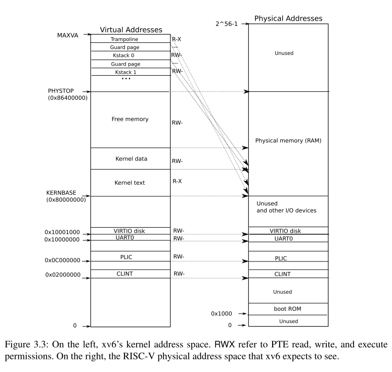

# 3.2 Kernel address space

Xv6维护在每个进程中维护一个页表用于描述每个进程的用户地址空间，外加一个单独的页表用于描述内核的地址空间。内核配置它自己的地址空间的布局让它可以以可预测的虚拟地址访问物理内存和各种硬件资源。图3.3展示了这种布局如何将内核虚拟地址映射到物理地址。文件(kernel/memlayout.h)声明了xv6内核内存布局的常量。

QEMU模拟的计算机包含RAM（物理内存），从物理地址**0x80000000**，至少到0x86400000，xv6称之为**PHYSTOP**。QEMU模拟还包括I/O设备，如磁盘接口。QEMU将设备接口作为***memory-mapped(内存映射)***控制寄存器暴露给软件，这些寄存器位于物理地址空间的**0x80000000**以下。内核可以通过读取/写入这些特殊的物理地址与设备进行交互；这种读取和写入与设备硬件而不是与RAM进行通信。第4章解释了xv6如何与设备交互。

内核使用直接映射的方式获得RAM和内存映射设备寄存器，也就是说映射在虚拟地址上的资源的物理地址和虚拟地址相同。例如，内核本身在虚拟地址和物理内存的地址都是KERNBASE=0x80000000。直接映射简化了读写物理内存的内核代码。举个例子，当fork系统调用给它的子进程分配用户内存时，分配器返回这个内存的物理地址；当fork系统调用拷贝父进程的用户内存到子进程时，使用物理地址直接作为虚拟地址。

这有一些内核不是直接映射虚拟地址的情况:

- trampoline页。它映射在虚拟地址空间的顶端；用户页表也有相同的映射。第四章讨论trampoline的作用，但是这里我们看到了一个页表有趣的使用；一个物理页(存放trampoline码)在内核虚拟空间映射了两次: 一次是在虚拟地址的顶端，一次是直接映射。
- 内核栈页。每个进程都有它自己的内核栈，它被映射在高处，所以在它下面，xv6可以放置一个未映射的保护页(guard page)。保护页的页表项是无效的(也就是PTE_V没有设置)，所以如果内核发生内核栈溢出，它可能会导致异常，内核会报错。如果没有保护页，一个溢出的栈将重写其他的内核内存，会导致不正确的操作。报错会比较好。

虽然内核使用它的栈通过高地址映射，但是他们也可以通过直接映射的方式访问内核。一个替代的设计方案是或许仅有直接映射，并且在直接映射的地址使用内核。然而，在这种安排下，提供保护页将涉及到取消映射虚拟地址，这些地址将指向物理内存，这将很难使用。

内核为trampoline和text(可执行程序的代码段)映射的页会有**PTE_R**和**PTE_X**权限。内核从这些页读取和执行指令。内核映射的其他page会有**PTE_R**和**PTE_W**权限，以便内核读写这些页面的内存。守护页的映射是无效的（设置**PTE_V**）；